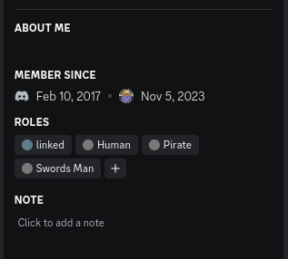
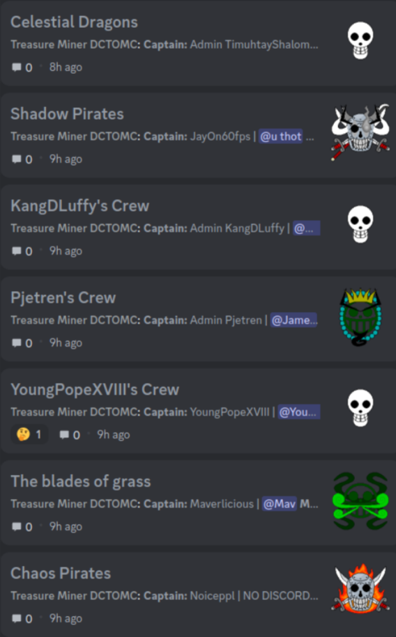

<h1 align="center">Role and Crew Assigner</h1>

<p align="center">Role and Crew Assigner is a Minecraft Addon for the popular <a href="https://www.curseforge.com/minecraft/mc-mods/mine-mine-no-mi"> Mine Mine no Mi Mod</a> mod.</p>

<p align="center">It also is an Integration for the <a href="https://modrinth.com/plugin/dcintegration">Discord Integration Mod</a> to streamline the process of adding this Addon in your server environment!</p>

# Description
<h3 align="center">Role Assigner</h1>
<p align="center">  </p>
<p align="center">
This addon automatically assigns Roles based on Faction, Race and Fighting Styles chosen in-game.  
</p>

<p align="center">
Those automatically update as well, when a Character Creation Book has been used or any of those Stats have been changed in any other way.
</p>

<h3 align="center">Crew Assigner</h3>
<p align="center">  </p>

<p align="center">
The second part of the mod consists of synchronizing crews of the Mine Mine no Mi Mod into a Discord Forum Channel.
</p>

<p align="center">
This also synchronizes crew kicking, leaving, captains and captain change, members and creation date.
</p>


# Important

In order for the addon to work several changes to the main Mine Mine no Mi mod had to be made.  
Those changes have already been committed by me to the main mod and will be available with the next Update.
Specifics are in [Technical Details](#technical-details).  

It is imperative that for now this custom version is used. Changes in there are purely server sided. So only you need to install this version on your server.  
Players can still use the normal Mine Mine no Mi Version.

The custom version can be found under `libs/mine-mine-no-mi-1.16.5-0.9.5-HAMMERCLOCK.jar`.  
The addon will not work with any other version.

I HAVE EXPLICIT PERMISSION BY THE CREATOR OF THE MINE MINE NO MI MOD TO REDISTRIBUTE THIS.  
YOU DO NOT! THEREFORE EVERY FURTHER REDISTRIBUTION HAS TO HAPPEN BY REFERENCING TO THIS PAGE!
# Installation

```
git clone https://github.com/rathmerdominik/MineMineNoMiRoleAndCrewAssigner.git
cd MineMineNoMiRoleAndCrewAssigner
./gradlew build
cd build/libs
```
You can now just take the jar file out of this directory and place it under the `mods/` folder on your server.

This mod requires Discord Integration 3.0.3 to be installed and setup on your server!
# Config Options

```toml
#To disable a specific Role from syncing just do not change the ID on the config option
[Races]
	"Human Role Id" = 0
	"Mink Role Id" = 0
	"Cyborg Role Id" = 0
	"Fishman Role Id" = 0

[Factions]
	"Bounty Hunter Role Id" = 0
	"Revolution Army Role Id" = 0
	"Marine Role Id" = 0
	"Pirate Role Id" = 0

["Pirate Crews"]
	"Sync Crew Members" = true
	"Show Crew Creation Date" = true
	#Has to be a Forum channel! Therefore your server MUST be a community server!
	"Crew Forum Channel Id" = 0
	"Show Captain of the crew" = true
	"Sync Crew Banner" = true

["Fighting Styles"]
	"Art of Weather Role Id" = 0
	"Brawler Role Id" = 0
	"Sniper Role Id" = 0
	"Black Leg Role Id" = 0
	"Doctor Role Id" = 0
	"Swords Man Role Id" = 0
```

# Technical Details

Those are the changes that i made to the Mine Mine no Mi mod for this addon to work.  
As already mentioned those changes will be in the main mod with the next update!

`/src/main/java/xyz/pixelatedw/mineminenomi/api/crew/JollyRoger.java`
```diff
 package xyz.pixelatedw.mineminenomi.api.crew;

+import java.awt.Color;
+import java.awt.image.BufferedImage;
+import java.io.IOException;
 import java.util.Arrays;
+import java.util.Optional;
+
+import javax.imageio.ImageIO;

 import net.minecraft.nbt.CompoundNBT;
 import net.minecraft.nbt.ListNBT;
@@ -9,6 +15,7 @@ import net.minecraftforge.common.util.Constants;
 import net.minecraftforge.fml.common.registry.GameRegistry;
 import xyz.pixelatedw.mineminenomi.ModMain;
 import xyz.pixelatedw.mineminenomi.init.ModJollyRogers;
+import xyz.pixelatedw.mineminenomi.wypi.WyHelper;

 public class JollyRoger
 {
@@ -254,4 +261,117 @@ public class JollyRoger
 	{
 		return Arrays.stream(this.details).parallel().anyMatch(detail -> detail != null && detail.equals(det));
 	}
+
+	/**
+	 * Returns the JollyRoger as a BufferedImage.
+	 *
+	 * Returns Optional.empty() if there have been an IOError.
+	 *
+	 * @return Optional<BufferedImage>
+	 */
+	public Optional<BufferedImage> getAsBufferedImage()
+	{
+		try {
+			BufferedImage jollyRogerImage = new BufferedImage(128, 128, BufferedImage.TYPE_INT_ARGB);
+
+			for (JollyRogerElement backgroundElement : this.backgrounds)
+			{
+				if (backgroundElement == null)
+				{
+					continue;
+				}
+
+				BufferedImage backgroundElementImage = this.elementToImage(backgroundElement);
+
+				jollyRogerImage.getGraphics().drawImage(backgroundElementImage, 0, 0, null);
+			}
+
+			BufferedImage jollyRogerBase = this.elementToImage(this.base);
+			jollyRogerImage.getGraphics().drawImage(jollyRogerBase, 0, 0, null);
+
+			for (JollyRogerElement detailElement : this.details)
+			{
+				if (detailElement == null)
+				{
+					continue;
+				}
+
+				BufferedImage detailElementImage = this.elementToImage(detailElement);
+
+				jollyRogerImage.getGraphics().drawImage(detailElementImage, 0, 0, null);
+			}
+
+			return Optional
+					.of(jollyRogerImage);
+		} catch (IOException e)
+		{
+			ModMain.LOGGER.error(e.getMessage());
+		}
+
+		return Optional.empty();
+	}
+
+	/**
+	 * Generates a BufferedImage with coloring if necessary out of a
+	 * JollyRogerElement
+	 *
+	 * @param element
+	 * @return BufferedImage
+	 * @throws IOException
+	 */
+	private BufferedImage elementToImage(JollyRogerElement element) throws IOException
+	{
+		String assetPath = "assets/mineminenomi/";
+
+		BufferedImage elementImage = ImageIO.read(getClass().getClassLoader()
+				.getResourceAsStream(assetPath + element.getTexture().getPath()));
+
+		if (element.canBeColored())
+		{
+			elementImage = this.applyColorToImage(element.getColor(),
+					elementImage);
+		}
+
+		return elementImage;
+	}
+
+	/**
+	 * Applies a color to a given image with the given hex value.
+	 * Skips pixels with no Alpha value or full black pixel.
+	 *
+	 * @param hex
+	 * @param element
+	 * @return BufferedImage
+	 */
+	private BufferedImage applyColorToImage(String hex, BufferedImage image)
+	{
+		Color color = WyHelper.hexToRGB(hex);
+
+		for (int x = 0; x < image.getWidth(); x++)
+		{
+			for (int y = 0; y < image.getHeight(); y++)
+			{
+				int rgba = image.getRGB(x, y);
+				Color pixelColor = new Color(rgba, true);
+
+				if (pixelColor.getAlpha() != 0 && (rgba & 0x00FFFFFF) != 0)
+				{
+					Integer tintedPixel = tintABGRPixel(pixelColor.getRGB(), color);
+					image.setRGB(x, y, tintedPixel);
+				}
+			}
+		}
+
+		return image;
+	}
+
+	public static Integer tintABGRPixel(int pixelColor, Color tintColor) {
+		int x = pixelColor>>16 & 0xff, y = pixelColor>>8 & 0xff, z = pixelColor & 0xff;
+		int top = 2126*x + 7252*y + 722*z;
+		int Btemp = (int)((tintColor.getBlue() * top * 1766117501L) >> 52);
+		int Gtemp = (int)((tintColor.getGreen() * top * 1766117501L) >> 52);
+		int Rtemp = (int)((tintColor.getRed() * top * 1766117501L) >> 52);
+	
+		return ((pixelColor>>24 & 0xff) << 24) | Btemp & 0xff | (Gtemp & 0xff) << 8 | (Rtemp & 0xff) << 16;
+	}
 }

```
`/src/main/java/xyz/pixelatedw/mineminenomi/api/events/CrewEvent.java`
```diff
 			super(player, crew);
 		}
 	}
+
+	@Cancelable
+	public static class Kick extends CrewEvent
+	{
+		public Kick(PlayerEntity player, Crew crew)
+		{
+			super(player, crew);
+		}
+	}
 }
```
`/src/main/java/xyz/pixelatedw/mineminenomi/api/events/JollyRogerEvent.java`
```diff
+package xyz.pixelatedw.mineminenomi.api.events;
+
+import net.minecraftforge.eventbus.api.Event;
+import xyz.pixelatedw.mineminenomi.api.crew.Crew;
+import xyz.pixelatedw.mineminenomi.api.crew.JollyRoger;
+
+public class JollyRogerEvent extends Event
+{
+	private JollyRoger jollyRoger;
+	private Crew crew;
+
+	public JollyRogerEvent(JollyRoger jollyRoger, Crew crew)
+	{
+		this.jollyRoger = jollyRoger;
+		this.crew = crew;
+	}
+
+	public Crew getCrew()
+	{
+		return this.crew;
+	}
+
+	public JollyRoger getJollyRoger()
+	{
+		return this.jollyRoger;
+	}
+	public static class Update extends JollyRogerEvent
+	{
+		public Update(JollyRoger jollyRoger, Crew crew)
+		{
+			super(jollyRoger, crew);
+		}
+	}
+}
```
`/src/main/java/xyz/pixelatedw/mineminenomi/packets/client/crew/CCreateCrewPacket.java`
```diff
 import net.minecraft.util.text.StringTextComponent;
 import net.minecraft.util.text.TextFormatting;
 import net.minecraft.util.text.TranslationTextComponent;
+import net.minecraftforge.common.MinecraftForge;
 import net.minecraftforge.fml.network.NetworkDirection;
 import net.minecraftforge.fml.network.NetworkEvent;
 import xyz.pixelatedw.mineminenomi.api.crew.Crew;
+import xyz.pixelatedw.mineminenomi.api.events.CrewEvent;
 import xyz.pixelatedw.mineminenomi.config.CommonConfig;
 import xyz.pixelatedw.mineminenomi.data.entity.entitystats.EntityStatsCapability;
 import xyz.pixelatedw.mineminenomi.data.entity.entitystats.IEntityStats;
@@ -63,21 +65,25 @@ public class CCreateCrewPacket
 				if(!hasSakeBottle || isAlreadyInCrew || !props.isPirate()) {
 					return;					
 				}
-				
 				Crew crew = new Crew(message.name, player);
-				worldProps.addCrew(crew);
-				crew.create(player.level);
-
-				if (CommonConfig.INSTANCE.isCrewWorldMessageEnabled())
+				
+				CrewEvent.Create event = new CrewEvent.Create(player, crew);
+				if(!MinecraftForge.EVENT_BUS.post(event))
 				{
-					TranslationTextComponent newCrewMsg = new TranslationTextComponent(ModI18n.CREW_MESSAGE_NEW_CREW, message.name);
-					for (PlayerEntity target : player.level.players())
+					worldProps.addCrew(crew);
+					crew.create(player.level);
+
+					if (CommonConfig.INSTANCE.isCrewWorldMessageEnabled())
 					{
-						target.sendMessage(new StringTextComponent(TextFormatting.GOLD + newCrewMsg.getString()), Util.NIL_UUID);
+						TranslationTextComponent newCrewMsg = new TranslationTextComponent(ModI18n.CREW_MESSAGE_NEW_CREW, message.name);
+						for (PlayerEntity target : player.level.players())
+						{
+							target.sendMessage(new StringTextComponent(TextFormatting.GOLD + newCrewMsg.getString()), Util.NIL_UUID);
+						}
 					}
+
+					WyNetwork.sendToAll(new SSyncWorldDataPacket(worldProps));
 				}
-				
-				WyNetwork.sendToAll(new SSyncWorldDataPacket(worldProps));
 			});
 		}
 		ctx.get().setPacketHandled(true);
```
`/src/main/java/xyz/pixelatedw/mineminenomi/packets/client/crew/CKickFromCrewPacket.java `
```diff
 import net.minecraft.entity.player.PlayerEntity;
 import net.minecraft.network.PacketBuffer;
 import net.minecraft.util.text.TranslationTextComponent;
+import net.minecraftforge.common.MinecraftForge;
 import net.minecraftforge.fml.network.NetworkDirection;
 import net.minecraftforge.fml.network.NetworkEvent;
+
 import xyz.pixelatedw.mineminenomi.api.crew.Crew;
+import xyz.pixelatedw.mineminenomi.api.events.CrewEvent;
 import xyz.pixelatedw.mineminenomi.api.helpers.FactionHelper;
 import xyz.pixelatedw.mineminenomi.data.world.ExtendedWorldData;
 import xyz.pixelatedw.mineminenomi.init.ModI18n;
@@ -52,11 +55,15 @@ public class CKickFromCrewPacket
 				
 				if(crew != null && crew.hasMember(uuid))
 				{
-					FactionHelper.sendMessageToCrew(sender.level, crew, new TranslationTextComponent(ModI18n.CREW_MESSAGE_KICKED, crew.getMember(uuid).getUsername()));
-					worldData.removeCrewMember(crew, uuid);
-					if(memberPlayer != null)
-						WyNetwork.sendTo(new SSyncWorldDataPacket(worldData), memberPlayer);
-					FactionHelper.sendUpdateMessageToCrew(sender.level, crew);
+					CrewEvent.Kick event = new CrewEvent.Kick(memberPlayer, crew);
+					if(!MinecraftForge.EVENT_BUS.post(event))
+					{
+						FactionHelper.sendMessageToCrew(sender.level, crew, new TranslationTextComponent(ModI18n.CREW_MESSAGE_KICKED, crew.getMember(uuid).getUsername()));
+						worldData.removeCrewMember(crew, uuid);
+						if(memberPlayer != null)
+							WyNetwork.sendTo(new SSyncWorldDataPacket(worldData), memberPlayer);
+						FactionHelper.sendUpdateMessageToCrew(sender.level, crew);
+					}
 				}
 			});	
 		}
```
`/src/main/java/xyz/pixelatedw/mineminenomi/packets/client/crew/CUpdateJollyRogerPacket.java`
```diff
 import net.minecraft.entity.player.PlayerEntity;
 import net.minecraft.network.PacketBuffer;
+import net.minecraftforge.common.MinecraftForge;
 import net.minecraftforge.fml.network.NetworkDirection;
 import net.minecraftforge.fml.network.NetworkEvent;
 import xyz.pixelatedw.mineminenomi.api.crew.Crew;
 import xyz.pixelatedw.mineminenomi.api.crew.JollyRoger;
+import xyz.pixelatedw.mineminenomi.api.events.JollyRogerEvent;
 import xyz.pixelatedw.mineminenomi.data.world.ExtendedWorldData;
 import xyz.pixelatedw.mineminenomi.packets.server.SSyncWorldDataPacket;
 import xyz.pixelatedw.mineminenomi.wypi.WyNetwork;
@@ -49,6 +51,10 @@ public class CUpdateJollyRogerPacket
 				ExtendedWorldData worldData = ExtendedWorldData.get(player.level);

 				Crew crew = worldData.getCrewWithCaptain(uuid);
+
+				JollyRogerEvent.Update event = new JollyRogerEvent.Update(message.jollyRoger, crew);
+				MinecraftForge.EVENT_BUS.post(event);
+
 				if (crew != null)
 					worldData.updateCrewJollyRoger(crew, message.jollyRoger);
```